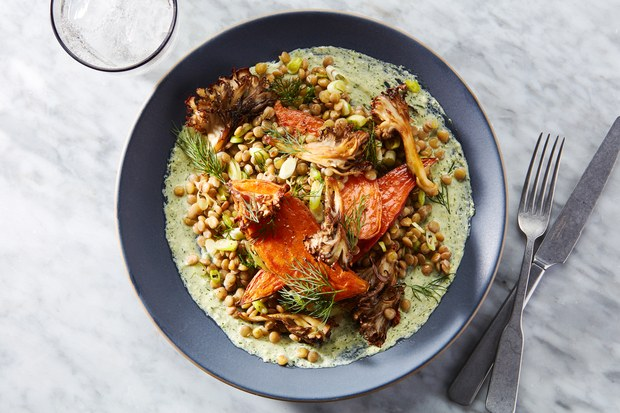

# improved-happiness

<figure>
  
  <figcaption>Photo by Joseph De Leo, Food Styling by Erika Joyce: from epicurios.com</figcaption>
</figure>

Good food is born after many experimentation. This repository contains some of the experiments 
I conducted to understand some of the magic behind good food.

Food recipes were obtained by scraping the site [epicurious.com][epicurious] which is a great site to explore food 
recipes. Next I try to generate some of the 10 most common tags for recipes, which turns out to be :

1. Peanut Free : 16554
2. Soy Free : 16119
3. Bon Appétit : 15524
4. Tree Nut Free : 14046
5. Vegetarian : 13557
6. Kosher : 12532
7. Pescatarian : 12301
8. Gourmet : 11158
9. Quick & Easy : 9635
10. Wheat/Gluten-Free : 9616

I used [NB-SVM][nbsvm] to solve this multilabel problem with 10 classes and got a ROC-AUC score of 0.788. 

Requirements
------------
* [Python][python] 3.7.3+
* [Scrapy][scrapy] 1.7.3+ 
* [Pandas][pandas] 0.25.1+
* [scikit-learn][sklearn] 0.21.3+

[python]: https://www.python.org/
[scrapy]: https://scrapy.org/
[epicurious]: https://www.epicurious.com/
[pandas]: https://pandas.pydata.org/
[sklearn]: https://scikit-learn.org/stable/index.html
[nbsvm]: https://nlp.stanford.edu/~sidaw/home/_media/papers:compareacl.pdf